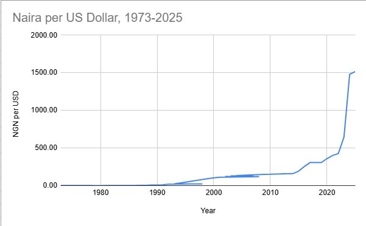
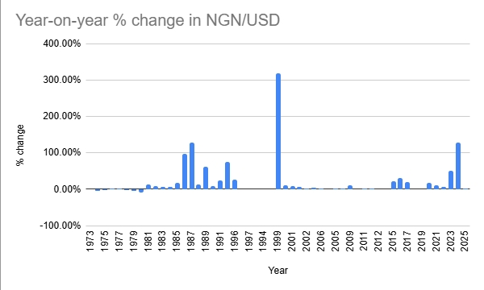
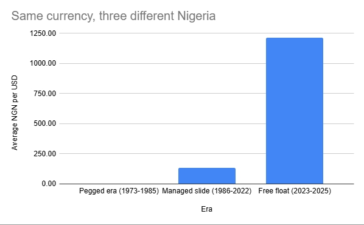

# Nigeria Exchange Rate Analysis (1973–2025)

> 52 years of the naira in three charts. Every spike lines up with a decision.

## The Question

Everyone in Nigeria *feels* the naira story. I wanted to *see* it: when did the currency actually fall, by how much, and what did each era of exchange-rate policy look like in plain numbers?

## Data

| Detail | Info |
|---|---|
| Source | [World Bank — Official exchange rate (LCU per US$, period average)](https://data.worldbank.org/indicator/PA.NUS.FCRF?locations=NG) · raw file: [`API_PA.NUS.FCRF_DS2_en_csv_v2_404139.csv`](data-raw/API_PA.NUS.FCRF_DS2_en_csv_v2_404139.csv) |
| Coverage | Nigeria, 1973–2025 (the naira was introduced in 1973; earlier values are in pounds) |
| Granularity | Annual averages · Raw file untouched in [`data-raw/`](data-raw/) |

## Tools

Google Sheets only — cleaning, a `% change` column, three charts. Deliberately reproducible by anyone with a spreadsheet.

## The Three Charts

**Chart 1 — The trend.** Half a century in one line: decades flat against the axis, a slow climb from the late 90s, then a near-vertical wall from 2023.

**Chart 2 — Year-on-year change.** Mostly silence for decades, a few alarms (1986–87, 1999, 2015–16), then two towers on the right: +51.5% (2023) and +129.2% (2024).

**Chart 3 — Three eras.** Pegged era average: **₦0.66/USD**. Managed slide (1986–2022): **₦131.19/USD**. Free float (2023–2025): **₦1,214.18/USD**. The pegged bar is invisible at this scale — that *is* the finding.

## Key Insights

**1. The fall started in 1986 — with SAP.**
For over a decade, one dollar cost less than one naira. That ended in 1986 when General Ibrahim Babangida's government introduced the Structural Adjustment Programme: market forces were allowed to price the naira for the first time. It fell 96.3% in 1986, then another 128.9% in 1987. Every later spike repeats the same pattern — an official rate held steady, then a sudden correction toward reality.

**2. The worst year on record: 1999, ~+320%.**
₦22 → ~₦92 per dollar in twelve months — not an economic collapse, but the outgoing military government finally letting the official rate catch up with the street rate at the return to democracy. A dollar that cost ₦0.60 in 1979 cost ₦92 in 1999 — 155× more naira for the same dollar.

**3. 2014–2016 was a replay, driven by oil.**
Crude fell from ~$115 to under $30 a barrel. The Central Bank devalued twice, then moved to a flexible rate in 2016 (+21.4% in 2015, +31.9% in 2016). Same script: hold, then break.

**4. 2023–2024 was different — a float, not a fix.**
In June 2023 the CBN stopped defending the naira and let it float: **+51.5%** in 2023, **+129.2%** in 2024. Painful, but the first correction made by design rather than in a crisis.

**5. The engineering read.**
A manufacturer importing raw materials pays in dollars: ~₦0.9/$ in 1985, ~₦1,550/$ in 2025. Nothing in the plant changed — the cost structure changed underneath it. Currency exposure is process economics, and it is exactly what a process engineer with data skills is built to quantify.

## Limitations

- **Annual averages hide timing** — the June 2023 float happened mid-year; the annual figure understates what buyers faced in late 2023.
- **Official rate ≠ parallel rate** — from 1986 to 2023 the official number was partly administrative fiction; the street rate told a harsher story.
- **One currency pair** — no inflation adjustment; a real-terms analysis is the natural sequel.

## Reproduce

Open [`analysis/nigeria_exchange_rate.xlsx`](analysis/nigeria_exchange_rate.xlsx) in Excel or Google Sheets — all cleaning, formulas, and charts are in the workbook.

## Author

**Favour Chukwuemeka David** — final-year Chemical Engineering student applying data analysis to questions the process industries care about.

[LinkedIn](https://www.linkedin.com/in/favour-david-767b072b3) · [GitHub](https://github.com/favourdavidemeka)
